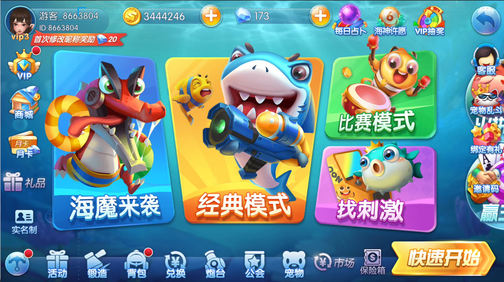
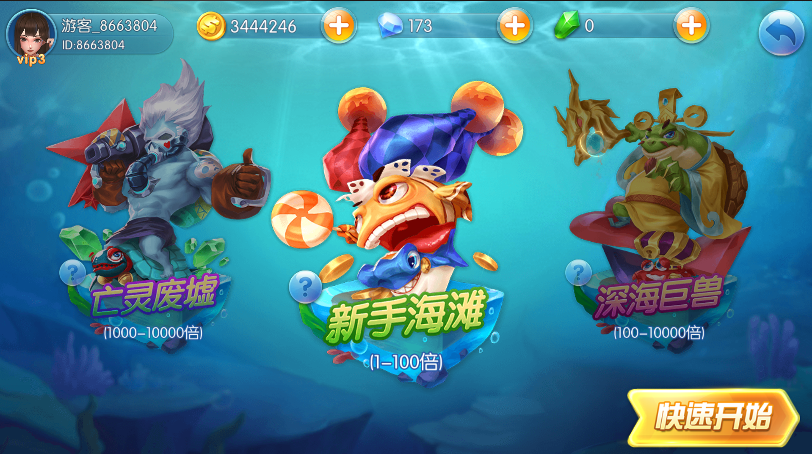
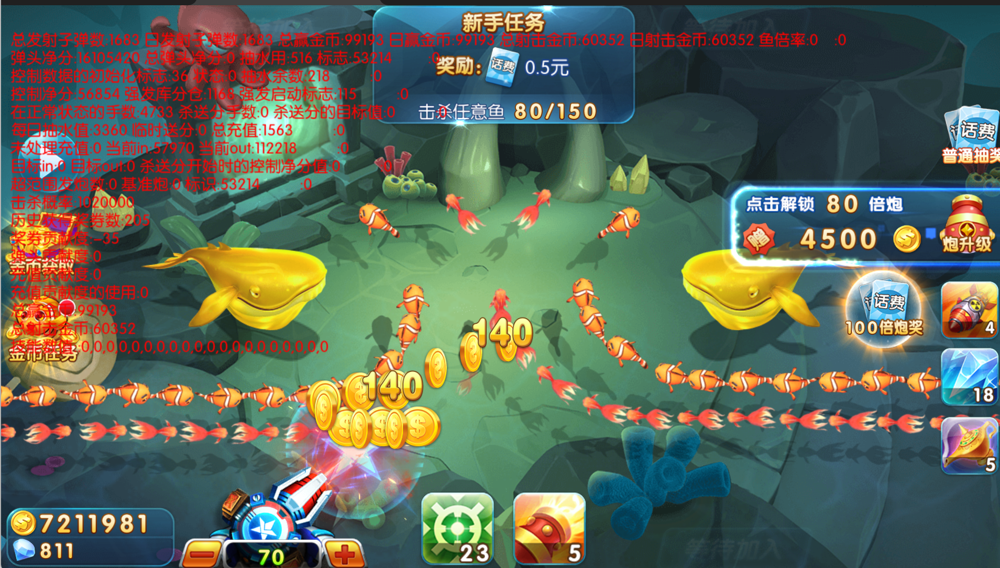
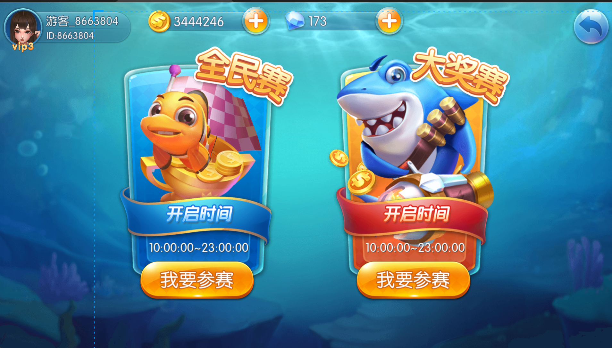
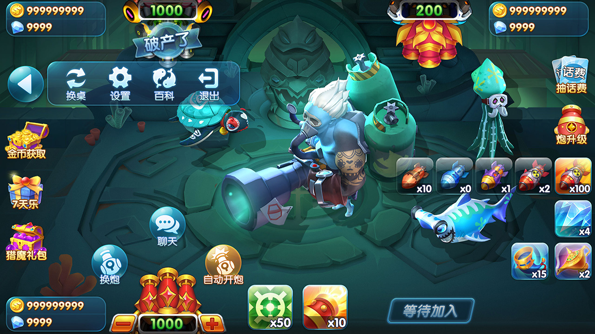
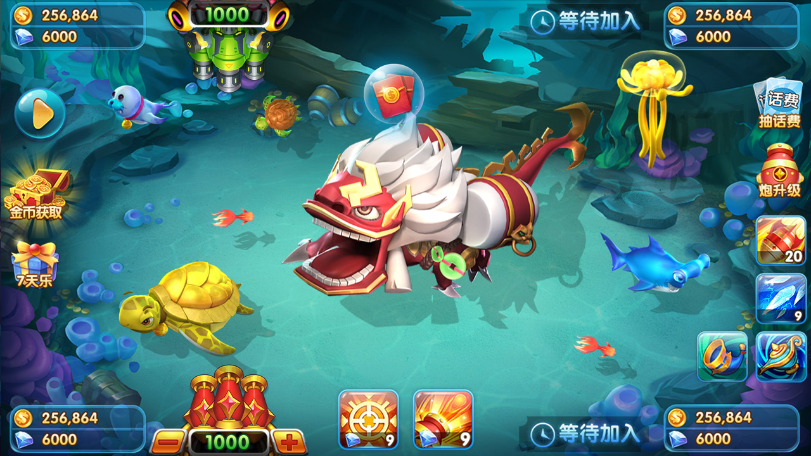
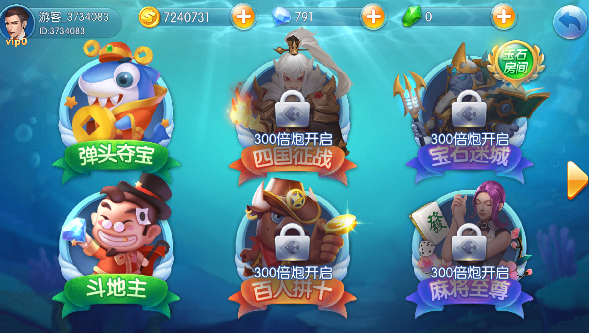
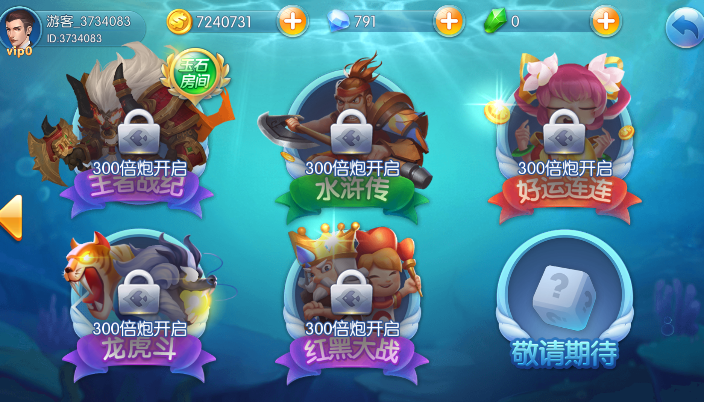

# OceanRaid 捕魚遊戲全端原始碼 | Arcade Fishing Game Source Code

> 採用 Cocos 用戶端 + Python/C++ 遊戲伺服器 + Node.js 營運後台的多人街機捕魚遊戲平台原始碼。

[简体中文](README.md) | [繁體中文](README.zh-TW.md) | [English](README.en.md) | [線上文件](https://masterai-top.github.io/OceanRaid-Fishing-Game-Platform/) | [商業授權](LICENSE)


OceanRaid 是一套面向行動裝置與街機娛樂產品的捕魚遊戲全端專案，涵蓋用戶端、即時遊戲服務、營運管理後台以及多種玩法入口。此儲存庫適用於合法的軟體評估、技術研究、二次開發和商業授權洽談。

## 核心捕魚玩法

### 1. 經典模式 | Classic Mode

| 場景 | 倍率範圍 |
| --- | --- |
| 海妖漩渦 | 1–30000 倍 |
| 新手灘 | 1–30000 倍 |
| 深海巨獸 | 1–30000 倍 |
| 幽靈船長 | 1–30000 倍 |

### 2. 比賽模式 | Tournament Mode

- 即時多人競技
- 排行榜系統
- 豐富獎勵機制

### 3. 玉石場 | Jade Field

| 場景 | 倍率範圍 |
| --- | --- |
| 亡靈廢墟 | 5000–10000 倍 |
| 天宮亂鬥 | 5000–10000 倍 |

### 4. 找刺激 | Thrill Zone

| 遊戲 | 類型 |
| --- | --- |
| 彈頭奪寶 | 休閒競技 |
| 四國征戰 | 策略對戰 |
| 寶石迷城 | 消除闖關 |
| 鬥地主 | 棋牌 |
| 麻將 | 棋牌 |
| 拼十 | 棋牌 |
| 王者戰績 | 競技 |
| 水滸傳 | 拉霸遊戲 |
| 好運連連 | 轉盤 |
| 龍虎鬥 | 棋牌 |
| 紅黑大戰 | 棋牌 |

## 擴充休閒玩法

彈頭奪寶、四國征戰、寶石迷城、鬥地主、麻將、拼十、王者戰績、水滸傳、好運連連、龍虎鬥和紅黑大戰。

> 玩法名稱、倍率和可用模組以實際交付版本及當地法律要求為準。涉及支付、虛擬物品、機率、競賽或獎勵的功能，上線前必須完成目標地區的法律、平台政策和未成年人保護審查。

## 產品能力

- 上百種魚類與多套首領、生物和海域場景資源
- 多房間、多砲台、多人即時同步與賽事流程
- 活動、任務、排行、設定、日誌和營運資料管理
- Cocos 用戶端、Python/C++ 伺服器與 Node.js 營運後台
- 面向 Android、iOS 和客製化終端的二次開發基礎
- 管理員分級權限、參數設定、操作日誌與風險控制擴充點

## 技術架構

```text
Cocos Client
     |
     v
Gateway / Session Services
     |
     +--> Python business services
     +--> C++ real-time game services
     +--> Match, room and fishing engines
     +--> Database, cache and message services
     |
Node.js Operations Console
```

實際資料庫、中介軟體、部署版本和外部依賴應以原始碼中的設定與部署文件為準，不應僅根據本介紹推斷可以一鍵上線。

## 專案結構

```text
client/                 # Cocos 用戶端原始碼
server-python/          # Python 業務服務
server-cpp/             # C++ 即時遊戲與房間服務
admin/                  # Node.js 營運後台
database/               # 資料庫結構與遷移（移除真實資料）
config.example/         # 去識別化設定範例
scripts/                # 建置和部署輔助指令碼
docs/                   # GitHub Pages 產品與技術文件
tests/                  # 自動化測試和驗證案例
.github/workflows/      # CI 與 GitHub Pages 工作流程
```

## 產品截圖

| 遊戲大廳 | 經典大廳 | 經典捕魚 |
| --- | --- | --- |
|  |  |  |

| 比賽模式 | 海魔來襲大廳 | 海魔來襲 |
| --- | --- | --- |
|  |  |  |

| 玉石大廳 | 玉石場 | 捕魚戰鬥畫面 |
| --- | --- | --- |
|  |  |  |

| 戰鬥場景 | 小遊戲入口一 | 小遊戲入口二 |
| --- | --- | --- |
|  |  |  |

## 營運資料

> 以下为项目方提供的停服前历史数据，未在本仓库中独立审计，不构成收益承诺。

| 指标 | 历史数据 |
| --- | ---: |

| 每日活躍使用者 | 50,000+ |
| 同時在線峰值 | 8,000+ |
| 付費率 | 18.6% |
| ARPU | ¥130+ |

## 聯絡方式

如有任何問題或合作意向，歡迎聯絡：

- Telegram：`@xuzongbin001`
- Email：`masterai918@gmail.com`


---

## 🚀 快速开始 | Quick Start

### 环境要求 | Requirements

| 组件 | 版本要求 |
|------|----------|
| Cocos Creator | v2.x / v3.x |
| C++ 编译器 | GCC 7+ / MSVC 2019+ |
| Python | 3.8+ |
| Node.js | 14+ |
| MySQL | 5.7+ |
| Redis | 6.0+ |

### 安装部署 | Installation

```bash
# 1. 克隆仓库
git clone https://github.com/yourusername/FishingGameHall-Pro.git
cd FishingGameHall-Pro

# 2. 导入客户端
# 使用Cocos Creator打开 client/ 目录

# 3. 编译C++服务器
cd server/cpp
mkdir build && cd build
cmake ..
make

# 4. 启动Python逻辑服务
cd server/python
pip install -r requirements.txt
python main.py

# 5. 启动运营后台
cd admin
npm install
npm start

# 6. 导入数据库
mysql -u root -p < database/mysql/schema.sql
```

## Star History

如果這個專案對您有幫助，請給予一個 Star 支持。

## 關鍵字

捕魚原始碼、捕魚遊戲原始碼、街機捕魚原始碼、Cocos 捕魚遊戲、多人捕魚伺服器、捕魚營運後台、arcade fishing game source code、fish shooting game、Cocos game client、Python game server、C++ game server、Node.js admin dashboard。
